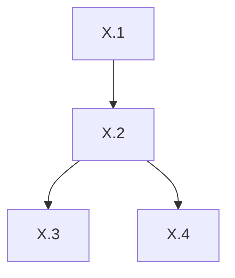

# 実装計画書作成のためのメタ計画書

## 目的
「偏執的グラフィック強化 9プロポーザル」を、**フェーズ1〜9 × ステップ1〜72** の詳細実装計画書に落とし込むための手順・構成・品質基準を定義する。

---

## 1. 計画書の構成方針

### 1.1 階層構造
```
Phase (9) → Step (72) → Task (各ステップ 3-5 タスク) → Deliverable / Acceptance Criteria
```

### 1.2 フェーズ割り当て（案）
| Phase | 対象プロポーザル | ステップ数 | 概算工数 |
|-------|-----------------|------------|----------|
| 1 | 動的ライティング・シャドウ | 8 | 3w |
| 2 | パーティクル・エフェクト | 8 | 3w |
| 3 | アニメーションスプライト | 8 | 3w |
| 4 | ポストプロセス・シェーダー | 8 | 2w |
| 5 | プロシージャル生成 | 8 | 3w |
| 6 | UI/UX マイクロインタラクション | 8 | 2w |
| 7 | サウンド連動ビジュアライゼーション | 8 | 2w |
| 8 | アクセシビリティ・カラーグレーディング | 8 | 2w |
| 9 | パフォーマンス最適化・LOD | 8 | 3w |
| **Total** | | **72** | **~23w** |

### 1.3 ステップ粒度の基準
- **1ステップ = 1-2日で完了可能な作業単位**
- **明確な成果物（コード/アセット/ドキュメント/テスト）を持つ**
- **前提依存関係が明示されている**

---

## 2. 計画書作成プロセス

### Step M1: 現状分析・制約整理 (0.5日)
- 既存コードベースのレンダリングパイプライン把握
- Three.js / WebGL2 / WebGPU 対応状況確認
- ビルドツール・CI環境確認
- 依存ライブラリバージョン固定方針

### Step M2: フェーズ・ステップ詳細分解 (1日)
- 各プロポーザルを 8 ステップに分解
- ステップ間依存グラフ作成
- クリティカルパス特定
- マイルストーン設定

### Step M3: タスク・受け入れ基準定義 (1日)
- 各ステップを 3-5 タスクに分解
- **Definition of Done** 統一フォーマット策定
- 自動テスト・目視確認・ベンチマーク基準設定

### Step M4: リスク・前提・除外事項整理 (0.5日)
- 技術的リスク（WebGPU未対応ブラウザ等）
- スコープ外明示
- 代替案・フォールバック戦略

### Step M5: 計画書ドキュメント生成 (0.5日)
- Markdown 形式で統一
- 目次・相互参照・進捗管理用チェックボックス付与
- `IMPLEMENTATION_PLAN_DETAILED.md` として出力

---

## 3. 計画書テンプレート（統一フォーマット）

```markdown
## Phase X: <プロポーザル名>

### 目標
<1-2文で成果物の本質を記述>

### 前提条件
- Phase Y 完了
- ライブラリ Z vN.N.N 導入済み

### ステップ一覧
- [ ] Step X.1: <タイトル> — <成果物> — <受け入れ基準>
- [ ] Step X.2: ...

### 依存グラフ


### リスク・対策
| リスク | 影響度 | 対策 |
|--------|--------|------|
```

---

## 4. 品質ゲート（各フェーズ完了条件）

| ゲート | 基準 |
|--------|------|
| **コード** | ESLint/Prettier/TypeScript strict pass, カバレッジ ≥ 80% |
| **性能** | ターゲットデバイスで 60fps 維持、GPU ms < 12ms |
| **視覚** | レファレンス画像との SSIM ≥ 0.95, 差分ピクセル < 0.1% |
| **互換** | Chrome/Firefox/Safari/Edge 最新 2バージョンで動作 |
| **文書** | README・API ドキュメント・移行ガイド完備 |

---

## 5. 進捗管理・運用ルール

- **日次**: ステップ単位でチェックボックス更新
- **週次**: フェーズ進捗サマリを Issue に集約
- **ブランチ戦略**: `feat/phase-X-step-Y` → `develop` → `main`
- **レビュー**: ステップ完了ごとに 1 approve 必須
- **ロールバック**: 性能劣化 > 5% で即 revert

---

## 6. 成果物チェックリスト（メタ計画完了時）

- [ ] `IMPLEMENTATION_META_PLAN.md` （本書）
- [ ] `IMPLEMENTATION_PLAN_DETAILED.md` （72ステップ詳細）
- [ ] 依存グラフ Mermaid 図（別ファイル可）
- [ ] リスク登録簿（別ファイル可）
- [ ] マイルストーン カレンダー（GitHub Milestone 連携用 JSON）

---

## 7. 即時アクション

1. 現状分析スクリプト実行 → `ANALYSIS_REPORT.md` 生成
2. 本メタ計画に基づき詳細計画書作成着手
3. 完了次第、GitHub Project にフェーズ・ステップ登録