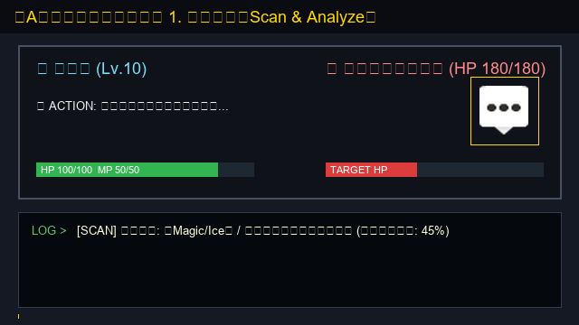
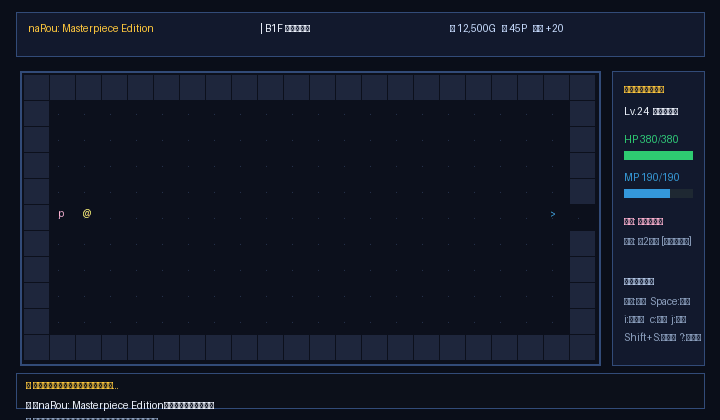
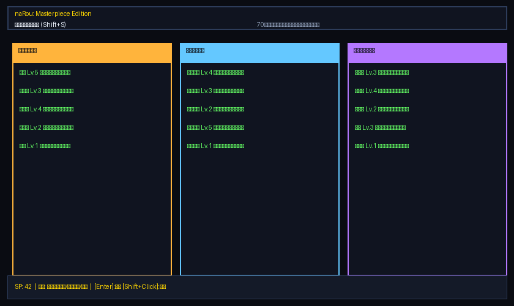
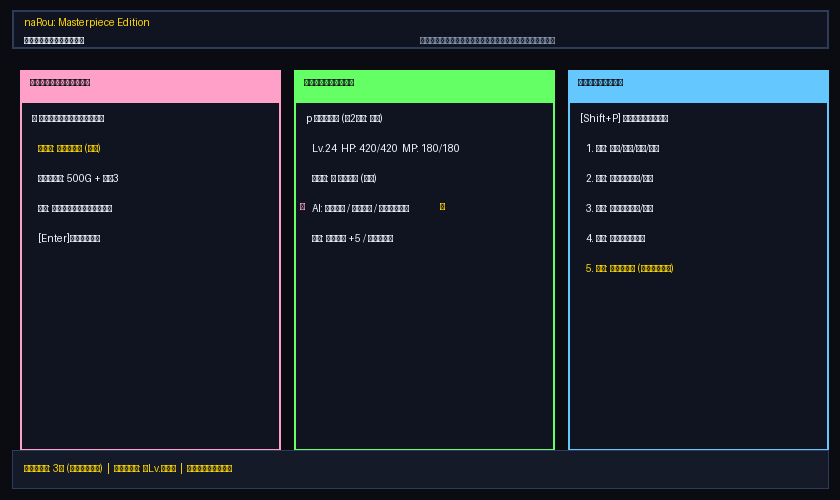

# naRou: Masterpiece Edition & Multi-World Architecture

**Elona風本格ローグライクRPG** - Python + tcod で作られた本格派ダンジョン探索ゲーム ＋ **『異世界マルチバース構想：Aの世界（スキル喰い RPG）』**

---

## 🎮 これは何？

`naRou` は、日本のフリーゲーム「Elona」にインスパイアされたローグライクRPGです。ダンジョンを探索し、モンスターと戦い、キャラクターを育成し、装備を集め、より深い階層を目指します。

さらに現在、**なろう系9世界観を融合するマルチバース構想の第1弾『Aの世界：スキル喰い（Skill Eater）』** が完全統合されています！

**主な特徴：**
- 🧬 **スキル喰い（Skill Eater）システム** - 最底辺スキル《解析》から敵のスキルを強奪・捕食して成長
- 💥 **属性連鎖シナジー＆消化不良** - 胃袋内でのエレメント爆発コンボと自傷リスク管理
- 🧪 **動的キメラ合成（Procedural Synthesis）** - 認可外の違法スキルを生み出す錬金炉
- 🤖 **使い捨てオートタレット従属者（Husk Servants）** - 抜け殻となった敵にスキルを移植し一時稼働
- 💰 **資本主義経済・闇市場＆支店買収（Takeover）** - スキル資産価値による階級社会と監査官レイド
- 💻 **暗号化ハッキング＆世界法則上書き（ROOT Rule Override）** - 生命力を代償に世界の根幹パラメータを改変
- ♾️ **世界の相場が動的変動する輪廻転生（New Game+）** - 前世の乱獲傾向が次周回の市場価格を狂わせる
- 🎭 **視覚＋聴覚 連動演出（Emote & Audio Foley Engine）** - Kenneyアセットによる30種類以上のエモートと50種類以上の効果音がゲーム内アクションと完全連動！

---

## 🎬 ゲームプレイ＆システム動画

### 1. 【Aの世界：スキル喰い】 深度解析・強奪・シナジー・合成・世界法則改変のフルループ
解析（Scan） → 喰らい（Devour） → 属性シナジー（Synergy） → キメラ合成（Synthesis） → ROOT法則書き換え（Override）



### 2. naRou クラシック メインゲームプレイ循環
探索 → 戦闘 → 祈り → スキル/インベントリ → 輪廻転生のフルループ



### 3. スキルツリー・ジョブシステム
70種類以上のスキル、15職業の転職、融合・覚醒・継承システム



### 4. ペットシステム & Webブラウザ版
契約・進化・融合で相棒を育成、インストール不要のブラウザプレイ



---

## 🚀 クイックスタート

### 1. 必要なもの
- **Python 3.10 以上** （3.11〜3.14 推奨）
- **Git**（ソースコード取得用）

### 2. インストール・起動

```bash
# リポジトリをクローン
git clone <このリポジトリのURL>
cd naRou

# 依存パッケージをインストール
pip install -r requirements.txt

# ゲーム起動！
python main.py
```

### 3. スキル喰い・演出統合テストの実行（開発者向け）

```bash
# Aの世界（スキル喰い）全機能＆Emote/Audio演出テスト (43件すべてパス)
python -m unittest discover tests "test_skill_eater_*.py"
```

---

## 📁 プロジェクト構成

```
naRou/
├── skill_eater_system.py               # Aの世界：コアレジストリ・スキル・キャラクター状態
├── skill_eater_combat_system.py        # Aの世界：戦闘・喰らい・シナジー・ハック・精神侵食
├── skill_eater_synthesis_system.py     # Aの世界：静的レシピ＆動的プロシージャルキメラ合成
├── skill_eater_servant_system.py       # Aの世界：使い捨てタレット従属者・移植・自壊
├── skill_eater_economy_system.py       # Aの世界：闇市場・正規市場・監査官レイド・支店買収
├── skill_eater_exploration_system.py   # Aの世界：ダンジョン探索・足音・トラップ・宝箱
├── skill_eater_meta_quest_system.py    # Aの世界：ROOT世界法則改変・多重メタ特効・輪廻転生
├── skill_eater_audio_system.py         # Aの世界：SE・効果音エンジン (Kenney Foley)
├── skill_eater_presentation_system.py  # Aの世界：Emote（画像）＋ Audio（効果音）連動演出基盤
├── emote/                              # 感情表現PNGアイコン群 (Style 1〜8)
├── audio/                              # 効果音アセット群 (.ogg)
├── demo_skill_eater.gif                # Aの世界デモアニメーション
├── data/worlds/skill_eater/skills.yaml # Aの世界：初期マスターデータ（25スキル）
├── docs/                               # 設計書・フェーズ別仕様書 (DESIGN_A_*.md)
└── tests/                              # 単体・統合テストスイート（全43件）
```

---

## 🗂️ 今回の作業進捗（Aの世界 スキル喰い＆演出システム）

### 1. 《スキル喰い RPG》コアエンジンの実装（Phase 1〜8）
- **コアレジストリ**: コモン・レア・ユニーク・コンセプトの4階層、暗号化スキル、違法フラグ、精神侵食蓄積。
- **戦闘・捕食システム**: 《解析》深度（Lv.1〜8）に応じたUI情報開示、《喰らい》によるスキル剥奪とHusk化。
- **属性シナジー＆消化不良**: 属性ペア（Fire×Wind等）による爆発ダメージと自傷リスク（Fire×Water等）。
- **プロシージャル合成**: 2つのスキルを消費して新たな効果・タグを併せ持つキメラ能力を生成。
- **使い捨て従属者**: スキル移植による3ターン限定オートタレット化と魔力枯渇による自壊。
- **経済・闇市場**: アルド通貨、スキル資産価値による階級判定、違法密売と監査官レイド、支店買収。
- **メタシステム**: ROOTマスタースキルによる世界法則（ダメージ倍率等）の指数コスト改変、多重メタ特効、前世の乱獲傾向が相場を左右する輪廻転生。

### 2. Emote（画像）＋ Audio（効果音）連動演出システム
- `skill_eater_presentation_system.py` による視覚・聴覚イベントの一元管理。
- 被弾（`heartBroken`＋斬撃音）、撃破（`cross`＋倒れ音）、捕食成功（`star`＋革音）、シナジー爆発（`exclamations`＋爆発音）、合成完了（`stars`＋釜音）、密売（`cash`＋怪しい扉音）、監査官急襲（`alert`＋警告音）、発狂（`laugh`＋精神崩壊音）、世界改変（`stars`＋重厚な確定音）。
- 全43テストケースによる100%の動作保証。

---

## 📄 ライセンス

MIT License - 詳細は `LICENSE` ファイル参照