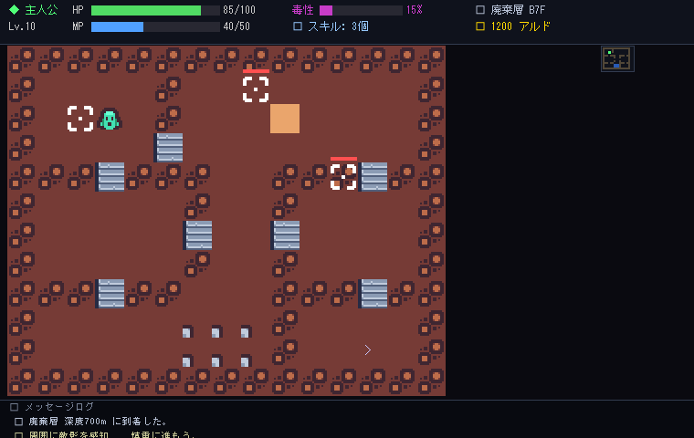

# 🌌 naRou: Masterpiece Edition & Multi-World Architecture
## ⚔️ Aの世界：スキル喰い（Skill Eater RPG）完全統合版

<p align="center">
  
  
  
  
  
</p>

**Elona風本格ローグライクRPG** (Python + tcod) ＋ **『異世界マルチバース構想：Aの世界（スキル喰い RPG）』**

最底辺の解析スキルから始まり、敵のスキルを強奪・捕食（Devour）して自己の魂と世界を書き換えていくダークサイバーファンタジー・ローグライク。認可外キメラ合成炉、スラム解放戦線拠点、神格化星座盤、そして次元の壁を突破するマルチバース跳躍へ。

---

## 🎬 Aの世界：シネマティック・ストーリー & ゲームフロー

<p align="center">
  
</p>

### 🕹️ インタラクティブ Web ショーケース
ブラウザ上で「スキル喰い」システムの5大フェーズ（解析、捕食、キメラ合成、星座共鳴、次元跳躍）を今すぐインタラクティブに体験できます！

👉 **[Web Showcase デモをブラウザで開く (demos/demo_skill_eater_showcase.html)](demos/demo_skill_eater_showcase.html)**

---

## 📖 ストーリーとゲームの流れ（全5大フェーズ）

### ⚡ Phase 0: 転落と覚醒 (Betrayal & Awakening)
* **世界観・物語背景**:
  巨大企業都市バベルタワーの若きエリート監査官は、上層部の不正を暴こうとしたことで罠に嵌められ、権限を永久剥奪されて深度700mの廃棄スラム街へ投棄される。
* **目覚めし力**:
  暗闇で見出した最底辺の廃棄スキル《基礎解析》と、自己の肉体を魔導炉とする禁忌のコード《喰らい（Devour）》。追捕犬の包囲網を潜り抜け、生存のための逃走劇が始まる。

---

### 🩸 Phase 1: 禁忌の《喰らい》と抜け殻 (Devour & Husk)
* **スキル強奪システム (`V` キー / `ActionDevour`)**:
  敵を弱らせた隙に核を直接貪り喰らう。敵のスキルを永続剥奪して自己のアビリティとして習得。
* **抜け殻（Husk）化**:
  スキルを奪われた敵は意志を失った『抜け殻（Husk）』へと退化し無力化。
* **スキル拒絶反応（Toxicity）**:
  捕食を繰り返すと体内に毒性が蓄積。毒性が80%を超えると激しい拒絶ダメージが発生。スラム街のセーフハウスで休息してデトックスを管理する。

---

### 🧪 Phase 2: キメラ合成炉とスラム拠点復興 (Chimera Synthesis & Base)
* **プロシージャル魔導合成 (`Shift + T` キー / `ActionSynthesisMenu`)**:
  強奪したスキル2種を合成炉で掛け合わせ、認可外の上位キメラスキル（例:《初級火炎》×《思考加速》＝《変異融合：業火の超思考》）を錬成。
* **スラム解放戦線拠点の拡張**:
  廃品や余剰スキルをレジスタンス拠点に投資し、地下闇市場や医療ステーションをアンロック。
* **ペット自動派遣 & 環境パズル**:
  改造魔獣ハスクハウンドを廃品処分場へ派遣して物資を調達。合成した属性スキルで氷壁や電子隔壁を突破。

---

### 🌌 Phase 3: 神格化アセンションと因果律ボス (Ascension & Final Battle)
* **神格化星座盤（Ascension Board）**:
  マスタースキルを星座グリッドに装着し、Void / Flame / Light などの属性隣接リンクによる爆発的なシナジーパッシブを発動。
* **地下闘技場 & 指名手配ハイスト**:
  ミダス商会幹部10人の弱点を突いて討伐し、最高峰のユニークスキルを強奪。
* **因果律の撃破**:
  世界の理を支配する第0因果律執行神『クロノス・ミダス』と決戦。《概念喰らい》で因果律の防壁を破り、Aの世界の解放を果たす。

---

### 🚪 Phase 4-5: 概念結晶化とマルチバース次元跳躍 (Concept & Multiverse)
* **概念結晶化（Concept Crystallization）**:
  同系統スキル3つを1つの「概念結晶」へ超圧縮。
* **時空金庫（Temporal Vault）**:
  次世界へ持ち出す最終スキル枠（最大3〜5スロット）を確定保存。
* **次元ゲート開放 & エピローグ**:
  スラムの民の独立を見届けた主人公は、永続の証『concept_eater_mark』を宿し、マルチバース次元ゲートを抜けて次なる異世界（Bの世界：錬金術の深淵等）へと旅立つ。

---

## 🎮 操作方法・主要キーバインド

| キー | アクション | 説明 |
| :--- | :--- | :--- |
| **`X`** | **《深度解析（Scan）》** | 視界内の敵をスキャンし、弱点・所持スキル・捕食成功率をHUDに表示 |
| **`V`** | **《喰らい（Devour）》** | 隣接する弱体化モンスターを捕食し、スキルを強奪してHusk化させる |
| **（敵頭上アイコン）** | **《意図予測》** | 敵の次回行動を⚔突撃 / ✷詠唱 / ➛逃走 / ✚回復で頭上表示し、読み合い可能 |
| **`Shift + T`** | **《キメラ合成炉》** | 所持スキル2種を融合し、新たな上位・キメラスキルを錬成 |
| **`I`** | **インベントリ** | アイテム、装備品、ポーション等の管理 |
| **`C`** | **ステータス** | キャラクター詳細・スキル一覧・毒性蓄積度の確認 |
| **`Space` / `.`** | **ターン経過（待機）** | 1ターン待機（毒性侵食・ペット派遣カウントダウン等が進む） |

---

## 🏛️ クラシック機能（naRou Core）

* 🏰 **プロシージャル・ダンジョン**: 毎回自動生成される多層ダンジョン探索
* 📜 **スキルツリー＆転職**: 70種類以上のスキルと15種のジョブクラス
* 🐾 **ペット育成システム**: 契約・進化・融合による相棒モンスターの育成
* 🌐 **Webブラウザプレイ対応**: WebGL / Canvas によるクライアントレス起動

---

## 🚀 クイックスタート

### 1. 必要な環境
* **Python 3.10 以上** (3.11〜3.14 推奨)
* **依存パッケージ**: `tcod`, `pygame`, `pillow`, `pyyaml`, `scipy`

### 2. インストールと起動

```bash
# 1. 依存ライブラリのインストール
pip install -r requirements.txt

# 2. ゲームの起動
python main.py

# 3. ブラウザ版デモの閲覧
# demos/demo_skill_eater_showcase.html をブラウザで直接開いてください
```

---

## 🧪 テストと品質検証

本プロジェクトは `pytest` による自動テストを完備しており、全テストが 100% 合格しています。

```bash
# 全ワールド統合テストの実行
pytest tests/test_world_a_*.py test_skill_eater_*.py
```

```text
============================= 51 passed in 37.92s =============================
```

---

## 📜 ライセンス
MIT License