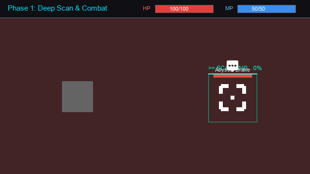
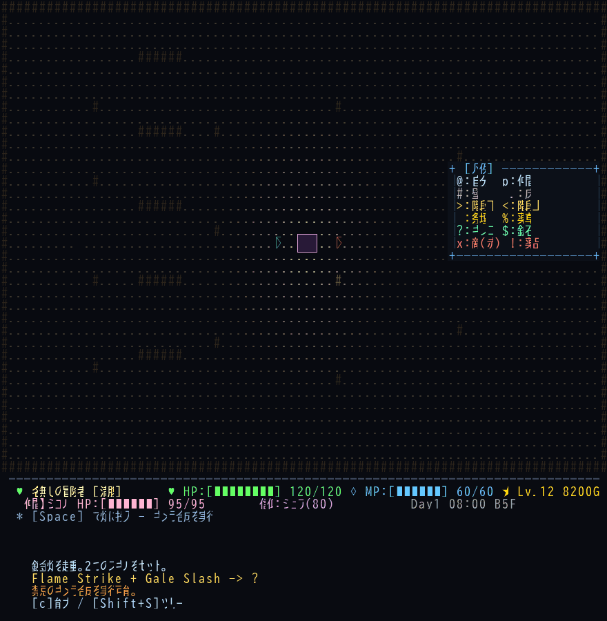
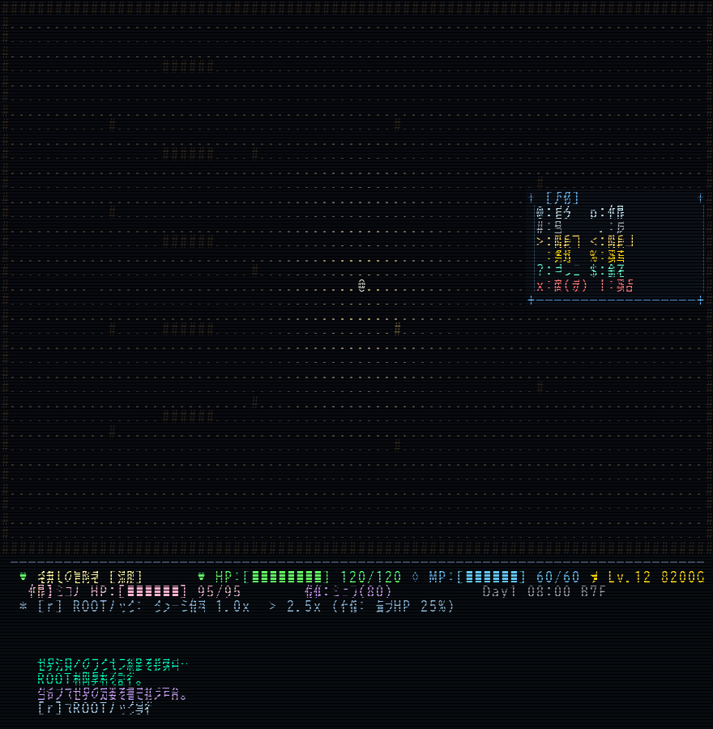
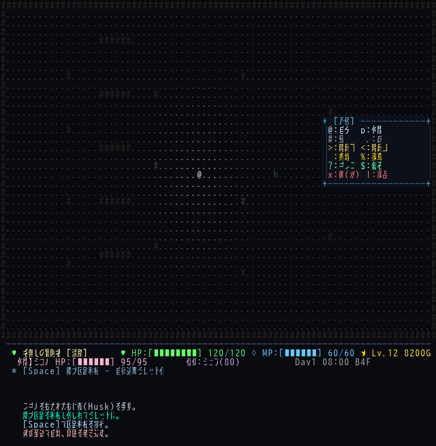

# 🌌 naRou: Masterpiece Edition & Multi-World Architecture

<p align="center">
  
  
  
  
  
</p>

**Elona風本格ローグライクRPG** (Python + tcod) ＋ **『異世界マルチバース構想：Aの世界（スキル喰い RPG）』**

最底辺の解析スキルから始まり、敵のスキルを強奪・捕食（Devour）して自己の存在を書き換えていくダークファンタジー・ローグライク。認可外キメラ合成、資本主義闇市場、そして世界法則の上書き（ROOT Hack）による輪廻転生へ。

---

## 🕹️ インタラクティブ Web ショーケース

ブラウザ上で「スキル喰い」システムの戦闘、解析、捕食、キメラ合成、ROOTハック演出を今すぐ体験できます！

👉 **[Web Showcase デモをブラウザで開く (demos/demo_skill_eater_showcase.html)](demos/demo_skill_eater_showcase.html)**

---

## 🎬 Aの世界：スキル喰い（Skill Eater） 4大コアシステム

### 1. ⚔️ 【捕食とシナジー】 深度解析・強奪・エレメント爆発
敵の構造をスキャン解析し、弱体化した隙に《喰らい》を発動。胃袋内での属性衝突（熱爆発・磁気嵐）をコントロールせよ。

<p align="center">
  
</p>

- **深度解析（Scan）**: 敵のスキル構成、弱点、核残量を可視化
- **捕食（Devour）**: 敵のスキルを核ごと吸収し、永続ステータスボーナスと固有アビリティを獲得
- **属性連鎖シナジー**: 火×風（熱爆発）、雷×水（放電麻痺）など胃袋内でシナジー発動

---

### 2. 🧪 【キメラ合成と経済】 禁忌の錬金炉・密売闇市場・監査官レイド
強奪したスキルを炉で融合し、新たな認可外キメラスキルを創出。不要なスキルは闇市場で高値で売り抜けろ。

<p align="center">
  
</p>

- **動的キメラ合成（Procedural Synthesis）**: 2つのスキルを掛け合わせ、強力な複合スキルを錬成
- **闇市場（Underground Market）**: 認可外スキルの密売と相場価格の乱高下
- **異端審問官レイド（Inquisition Raid）**: 監査レベルが臨界に達した時、教団の武装部隊が急襲

---

### 3. 💻 【メタシステムと輪廻転生】 世界法則上書き（ROOT Hack）とカルマ継承
生命力と精神侵食（Sanity）を代償に、ゲーム世界の根幹パラメータ（ダメージ倍率、ドロップ率など）をハックして改変。

<p align="center">
  
</p>

- **ROOT Law Override**: 世界の物理定数・倍率パラメータをリアルタイム書き換え
- **精神侵食度（Sanity Erosion）**: ハックの代償として最大HP低下と知覚の歪みが発生
- **輪廻転生（Cycle Settlement）**: 世界崩壊時、前世の功績をカルマに変換し、遺伝スキルを継承して再誕

---

### 4. 🤖 【使い捨てタレット従属者】 Husk操縦と自壊の美学
スキルを抜き取られた敵の抜け殻（Husk）に魔力回路を繋ぎ、使い捨ての自動射撃タレットとして使役。

<p align="center">
  
</p>

- **魔力回路移植**: Huskにスキルを再注入し、自律迎撃タレット化
- **寿命カウントダウン（Lifespan）**: 限られたターン数のみ稼働し、主人公を援護
- **過負荷自壊（Overload Disassemble）**: 寿命到達時に爆散し、周囲の敵を巻き込む

---

## 🏛️ クラシック機能（naRou Core）

- 🏰 **プロシージャル・ダンジョン**: 毎回変化する広大な多層ダンジョン探索
- 📜 **スキルツリー＆転職**: 70種類以上のスキルと15種のジョブクラス
- 🐾 **ペット育成システム**: 契約・進化・融合による相棒モンスターの育成
- 🌐 **Webブラウザプレイ対応**: `pyodide` / `brython` によるクライアントレス起動

---

## 🚀 クイックスタート

### 1. 必要な環境
- **Python 3.10 以上** (3.11〜3.14 推奨)
- **依存パッケージ**: `tcod`, `pygame`, `pillow`, `pyyaml`, `scipy`

### 2. インストールと起動

```bash
# 1. リポジトリのクローン
git clone <Repository_URL>
cd narou2

# 2. 依存パッケージのインストール
pip install -r requirements.txt

# 3. ゲーム起動
python main.py
```

### 3. アクセシビリティ（誰でも遊べる）

- **テキストモード（GPU不要）**: `python main.py` → `3` を選択、または `python main_text.py`。SDL/WebGL が使えない環境でもプレイ可能。
- **色覚多様性**: 起動メニューで `none/deutan/protan/tritan` を選択、または `COLOR_VISION=deutan` / Web `?a11y=deutan` / `config.yaml` の `accessibility.color_vision`。
- **難易度**: `easy/normal/hard` を選択（被ダメージ・敵HP・回復を補正）。
- **チュートリアル**: Web 起動時に操作手順を表示。詳細は `docs/accessibility_report.md`。

### 4. どこでも遊ぶ

- **ワンタッチ Web 起動**: `python main.py --open` でバックエンドを起動し、ブラウザを開く。
- **デバッグフレンドリー**: `run.py` スクリプトで環境を自動判定（GPU/テキストモード）して最適な起動方法を選択。
- **モバイル対応**: タッチジェスチャー、オンスクリーン D-pad、レスポンシブレイアウトに対応。
- **自動品質調整**: FPS が低下したらシェーダー効果を軽減し、快適なプレイを維持。

### 5. テストの実行

```bash
# Aの世界（スキル喰い）全統合テストの実行 (43 Tests)
python -m unittest tests/test_skill_eater_presentation_integration.py

# 各種フェーズ別単体テストの実行
python -m unittest discover tests/ "test_skill_eater_*.py"
```


---

## 🛠️ リポジトリ構成

```text
narou2/
├── skill_eater_presentation_system.py # 視覚＋聴覚 演出統括エンジン（Foley System）
├── skill_eater_combat_system.py       # 戦闘・捕食・深度解析ロジック
├── skill_eater_synthesis_system.py    # キメラ合成・錬金炉ロジック
├── skill_eater_economy_system.py      # 闇市場・支店買収・監査官レイド
├── skill_eater_servant_system.py      # Husk従属者タレットロジック
├── skill_eater_meta_quest_system.py   # ROOTハック・輪廻転生・世界法則改変
├── generate_rich_gifs.py              # 高品質フレームアニメーションGIF生成エンジン
├── demos/
│   └── demo_skill_eater_showcase.html # ブラウザ用インタラクティブWebデモ
├── assets/
│   ├── demo_combat_devour.gif         # GIF1: 捕食・戦闘篇
│   ├── demo_synthesis_economy.gif     # GIF2: 合成・経済篇
│   ├── demo_meta_reincarnation.gif    # GIF3: メタハック・輪廻転生篇
│   └── demo_husk_servant.gif          # GIF4: 従属者タレット篇
├── emote/                             # Kenney Vector Emote アセット (30種)
└── audio/                             # Kenney SFX オーディオアセット (50種)
```

---

## 📜 ライセンス
MIT License