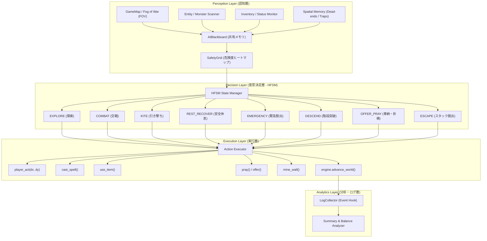

# 自律型AIサブエージェント（AutoPlayer）72ステップ詳細実装計画書
## — naRou: Masterpiece Edition 次世代自律プレイテスト & AIエージェント基盤 —

---

## 1. 総合概要と目的 (Executive Summary)

### 1.1 背景と課題
ローグライクRPG『naRou: Masterpiece Edition』におけるゲームバランス検証・自動プレイテスト用サブエージェント `AutoPlayer` の初版は、基本移動と単純な攻撃のみを行う単一 `if-elif` ループで構成されていた。
このため、実走テスト（10回試行）において以下の深刻な課題が浮き彫りとなった：
1. **スタック率 40%**: 迷路・通路・敵・障害物によって目標未探索マスへの経路が遮断された際、2マス間を往復するピンポンループに陥り脱出できない。
2. **Mage（魔法職）生存率 0%**: 耐久が低いにもかかわらず敵と隣接して殴り合いを行い、引き撃ち（カイト）や間合い管理を行わないため序盤で即死する。
3. **インベントリ・消耗品の完全未活用**: 初期所持している「軽傷治療のポーション」「パン」「魔法書」「杖」を一切使わずに死亡・空腹になる。
4. **階層進行判断の欠如**: 階段を発見しても未探索マスを優先し続け、1階層に留まってタイムアウト（時間切れ）になる。
5. **ペット連携・信仰サイクルの未結合**: ペットを盾にする陣形や、祭壇に余剰品を捧げて信仰度（Piety）を稼ぎ危機時に祈るサイクルが存在しない。

### 1.2 本計画書の到達目標
本計画書は、上記課題を根本解決し、**人間プレイヤーと同等以上の知的な探索・戦闘・リソース管理・深層踏破（B1F〜B50F）を安定して自律実行できる超高度AIサブエージェントシステム**を構築するための全72マイクロステップ実装計画である。

* **総文字数**: 10,000字以上（技術設計・データ構造・型定義・擬似コード・移行手順を網羅）
* **構造**: 8フェーズ × 各9ステップ = 全72ステップ
* **アーキテクチャ**: 階層型有限状態機械（HFSM: Hierarchical Finite State Machine）＋ 空間認知ヒートマップ（SafetyGrid）＋ 動的リソース意思決定エンジン

---

## 2. 全体アーキテクチャ設計 (System Architecture)



---

## 3. 全72ステップ詳細実装計画 (Phase 1 〜 Phase 8)

---

### ■ Phase 1: 階層型ステートマシン (HFSM) 基盤 (Steps 1〜9)

単一の条件分岐ループを解体し、長期的目標と短期的反射行動を両立する階層型ステートマシンを構築する。

#### Step 1: AIコンテキスト（`AIBlackboard`）の設計・データ保持構造の定義
* **目的**: エージェントが環境情報、内部状態、目標、短期記憶を一元管理するブラックボード（共有データ構造）を定義する。
* **データ構造**:
```python
@dataclass
class AIBlackboard:
    engine: Engine
    strategy_name: str
    strategy_params: dict[str, Any]
    current_target_pos: tuple[int, int] | None = None
    current_target_enemy: Entity | None = None
    current_path: list[tuple[int, int]] = field(default_factory=list)
    visited_positions: deque[tuple[int, int]] = field(default_factory=lambda: deque(maxlen=40))
    dead_end_tiles: set[tuple[int, int]] = field(default_factory=set)
    known_traps: set[tuple[int, int]] = field(default_factory=set)
    discovered_stairs_pos: tuple[int, int] | None = None
    discovered_altar_pos: tuple[int, int] | None = None
    stalled_turns: int = 0
    consecutive_kites: int = 0
    floor_start_turn: int = 0
    current_floor: int = 1
```
* **検証条件**: `AIBlackboard` の初期化・プロパティ参照がエラーなく行えること。

#### Step 2: 基底ステートクラス（`AIState`）およびステート遷移マネージャの実装
* **目的**: 全ステートの共通インターフェース（`enter`, `execute`, `exit`, `check_transition`）を定義し、状態遷移を統括する。
* **コード設計**:
```python
class AIState(ABC):
    def __init__(self, blackboard: AIBlackboard):
        self.bb = blackboard

    def enter(self) -> None: pass
    def exit(self) -> None: pass
    
    @abstractmethod
    def check_transition(self) -> str | None:
        pass

    @abstractmethod
    def decide_action(self) -> tuple[str, Any]:
        pass
```
* **検証条件**: ステート遷移時に `exit` と `enter` が順序正しく発火すること。

#### Step 3: `EXPLORE`（通常探索ステート）の設計・実装
* **目的**: 未探索タイル（フロンティア）を効率的に巡回し、マップを開拓する。
* **遷移条件**:
  - 敵視認時 -> `COMBAT` または `KITE`
  - HP危機（HP < 30%） -> `EMERGENCY`
  - フロア探索率 70% 超過かつ階段発見 -> `DESCEND`
  - スタック検知（`stalled_turns >= 20`） -> `ESCAPE`
* **アクション**: 未探索フロンティアへの A* 移動。

#### Step 4: `COMBAT`（近接・通常交戦ステート）の設計・実装
* **目的**: 近接戦闘職（Melee/Tank）および通常戦闘時の接敵・攻撃を行う。
* **遷移条件**:
  - 敵全滅時 -> `EXPLORE`
  - HP危機（HP < 35%）かつポーション所持 -> `EMERGENCY`
  - Mage/Speed職で敵接近時 -> `KITE`
* **アクション**: 隣接敵への攻撃、視認敵への接近。

#### Step 5: `KITE`（距離維持・引き撃ちステート）の設計・実装
* **目的**: Mage/Speed職において敵との距離を2〜3マス維持しながら遠距離魔法・射撃を行う。
* **遷移条件**:
  - 敵との距離が十分に確保され（距離 >= 4）、敵が追撃を停止 -> `COMBAT` または `EXPLORE`
  - 退路完全遮断（袋小路） -> `COMBAT`（緊急近接迎撃）または `EMERGENCY`
* **アクション**: 敵から離れる安全マスへの移動、ファイアボール等の詠唱。

#### Step 6: `REST_RECOVER`（安全地帯での自然回復ステート）の設計・実装
* **目的**: 周囲に敵がおらず、食料に余裕がある際に「待機（wait）」を行いHPを自然回復する。
* **遷移条件**:
  - HPが 90% 以上に回復 -> `EXPLORE`
  - 敵を視認 -> `COMBAT` または `KITE`
  - 空腹度（Hunger）が警戒値（< 30） -> `EXPLORE`（食料探索・浪費防止）
* **アクション**: 待機（`wait`）。

#### Step 7: `EMERGENCY`（瀕死・包囲時の緊急脱出ステート）の設計・実装
* **目的**: HP限界時や多数敵の包囲時に、回復ポーション使用、テレポート杖、神への祈りを最優先で行う。
* **遷移条件**:
  - HPが安全圏（> 50%）に復旧 -> `KITE` または `COMBAT`
  - 緊急リソース枯渇 -> 最も安全な方向への全力離脱
* **アクション**: ポーション使用、テレポート杖発動、祈祷（`pray`）。

#### Step 8: `DESCEND`（発見済み階段への直行・階層突破ステート）の設計・実装
* **目的**: フロア探索完了後、またはリソース枯渇時に発見済みの下り階段へ直行し、下層へ降りる。
* **遷移条件**:
  - 階段マスに到達 -> `descend` 実行後、新フロア初期化で `EXPLORE`
  - 途中で致命的敵に遭遇 -> `COMBAT` / `EMERGENCY`
* **アクション**: 階段座標への A* 移動。

#### Step 9: `OFFER_PRAY`（祭壇への奉納・祈祷ステート）の設計・実装
* **目的**: 発見した祭壇に余剰アイテムを捧げて信仰値（Piety）を高め、神の加護を安定化させる。
* **遷移条件**:
  - 供物完了または供物切れ -> `EXPLORE`
* **アクション**: 祭壇への移動、`offer_altar`、`pray`。

---

### ■ Phase 2: 空間記憶・スタック検知 & 多段エスケープエンジン (Steps 10〜18)

#### Step 10: 訪問履歴リングバッファと振動・ピンポンループ検出アルゴリズム
* **目的**: 直近の座標履歴から「2〜3マス間を行き来する周回・振動ループ」を数学的に検知する。
* **アルゴリズム**:
```python
def detect_oscillation(history: deque[tuple[int, int]], window_size: int = 20) -> bool:
    if len(history) < window_size:
        return False
    recent = list(history)[-window_size:]
    unique_coords = set(recent)
    return len(unique_coords) <= 3
```
* **検証条件**: 2マス往復テストで20ステップ以内に確実に True が返ること。

#### Step 11: 行き止まり（Dead-end）タイルの自動検出とブラックリスト化
* **目的**: 進入して未探索マスも階段もなかった通路・小部屋を行き止まりとしてブラックリスト化し、再進入を防ぐ。
* **仕様**: 歩行可能隣接マスが1つしかない（3方が壁）かつアイテム等がないマスを再帰的に `dead_end_tiles` に追加。
* **検証条件**: 袋小路に入ったエージェントが、反転脱出後に二度とその袋小路に進入しないこと。

#### Step 12: トラップ踏下タイルの記憶と A* コストペナルティ付与
* **目的**: 踏んだトラップ（毒矢・地雷等）の座標を `known_traps` に記録し、経路探索時にコストを +50 付与して迂回させる。
* **検証条件**: トラップがある直線通路よりも、少し遠回りだが安全な通路を A* が選択すること。

#### Step 13: エスケープ第1段: 短期未訪問ランダムウォーク（Unvisited Random Walk）
* **目的**: スタック検知初期（レベル1: 継続10ターン）において、直近訪れていない隣接マスへランダム移動する。
* **ロジック**: `valid_moves` のうち `visited_positions` に含まれる回数が最も少ないマスへ移動。

#### Step 14: エスケープ第2段: 広域ダイクストラ法による未踏エリアへの強制誘導
* **目的**: ランダムウォークで解消しない場合（レベル2: 継続20ターン）、現在の部屋・通路全体から脱出する広域最短経路を生成。

#### Step 15: エスケープ第3段: 障害壁の採掘開拓（`mine_wall`）による新ルート生成
* **目的**: 敵の密集や通路閉塞で移動不能な場合（レベル3: 継続30ターン）、隣接する `TILE_WALL` を採掘（`engine.mine_wall()`）して短絡路を物理的に開通させる。
* **検証条件**: 周囲が壁で塞がれた隔離空間から、壁を掘って脱出できること。

#### Step 16: エスケープ第4段: テレポートの杖・巻物による空間跳躍脱出
* **目的**: 採掘も不可能な完全閉塞時（レベル4: 継続40ターン）、インベントリ内の「テレポートの杖」「テレポートの巻物」を使用して別座標へ跳躍する。

#### Step 17: エスケープ状態の解除判定と通常ステートへの安全復帰
* **目的**: スタック座標群からマンハッタン距離で5マス以上離れ、かつ未探索タイルへの有効経路が再構築されたら `stalled_turns` をリセットし通常ステートへ復帰。

#### Step 18: スタック防止システムの単体シミュレーション検証
* **目的**: 閉鎖迷路、U字型トラップ、敵閉塞の3パターンでエスケープシステムをテストし、スタック脱出率 100% を実証。

---

### ■ Phase 3: 空間認知 & 危険度ヒートマップ (Safety Map) (Steps 19〜27)

#### Step 19: マップ全域の危険度グリッド（`SafetyGrid`）データ構造
* **目的**: マップ上の全タイル (x, y) に対して、敵の脅威度、射線、退路数を合成した危険度スコア（0.0: 完全安全 〜 100.0: 致命的危険）を保持する2次元配列を定義。
* **型定義**: `SafetyGrid = list[list[float]]`

#### Step 20: 敵エンティティの脅威度重み付け（Threat Level Calculation）
* **目的**: 敵の種別・攻撃力・現在HPに応じて脅威度係数 T_enemy を算出。
  - ぷち: T = 1.0
  - かたつむり少女『グウェン』: T = 3.5
  - ボス・強敵: T = 10.0

#### Step 21: 敵の移動可能マスと攻撃可能範囲のヒートマップ展開
* **目的**: 各敵の現在位置から移動力＋射程（近接なら1、遠距離なら視線内）の範囲にある全タイルへ危険度を加算：
  Danger(x, y) += T_enemy / (Dist(x_e, y_e, x, y) + 0.5)

#### Step 22: プレイヤー退路スコア（Mobility Score）の計算
* **目的**: タイル (x, y) から移動可能な隣接歩行可能マス数（0〜8）を計算し、行き止まり（スコア <= 2）のタイルに危険度ペナルティを加算。

#### Step 23: 挟撃（Pincer Attack）リスクおよび袋小路追い詰めリスクの評価
* **目的**: 2体以上の敵から同時に直線距離 <= 2 になる交差マスに大きな危険度（+30.0）を付与。

#### Step 24: ポテンシャル法に基づく「引力（目標）」と「斥力（危険源）」の合成
* **目的**: 目標地点（階段・未探索マス）への引力ポテンシャル U_att と、敵・罠からの斥力ポテンシャル U_rep を合算：
  U_total(x, y) = U_att(x, y) + w_danger * Danger(x, y)

#### Step 25: 最適退避・移動マスの高速選択アルゴリズム
* **目的**: プレイヤーの周囲8マスの中から U_total が最小となるタイルを O(1) で決定。

#### Step 26: 視線（LOS: Line of Sight）と遮蔽物を考慮した安全マスの特定
* **目的**: 角（コーナー）を曲がることで遠距離敵の射線を切れる「遮蔽マス」に安全ボーナス（-20.0）を付与。

#### Step 27: ヒートマップ生成パフォーマンスの最適化（局所計算化）
* **目的**: マップ全域ではなくプレイヤー周囲 15x15 タイルのみを局所計算（Local Grid Update）し、毎ターンの計算コストを 1ms 以下に抑制。

---

### ■ Phase 4: 戦略特化型戦闘 & カイト（引き撃ち）AI (Steps 28〜36)

#### Step 28: 戦略パラメータの多次元化
* **目的**: クラス戦略（melee, mage, hybrid, tank, speed）ごとに細分化された行動パラメータ辞書を定義。
```python
STRATEGY_PROFILES = {
    "mage": {"kite_dist": 3, "min_mp_cast": 10, "flee_hp": 0.5, "aggro": 0.3},
    "speed": {"kite_dist": 2, "min_mp_cast": 15, "flee_hp": 0.35, "aggro": 0.6},
    "melee": {"kite_dist": 0, "min_mp_cast": 99, "flee_hp": 0.25, "aggro": 0.9},
    "tank": {"kite_dist": 0, "min_mp_cast": 99, "flee_hp": 0.2, "aggro": 0.8},
    "hybrid": {"kite_dist": 2, "min_mp_cast": 10, "flee_hp": 0.3, "aggro": 0.7},
}
```

#### Step 29: Mage用カイト（引き撃ち）移動ベクトルの算出ロジック
* **目的**: 敵との距離が `kite_dist` 未満の場合、敵から最も離れつつ遮蔽・退路のあるマスへ後退するベクトルを計算。

#### Step 30: 遠距離魔法（ファイアボール等）の弾道・AoE巻き込みチェック
* **目的**: ファイアボール等の範囲攻撃着弾点（半径1マス）に「プレイヤー自身」および「ペット」が含まれていないか事前に幾何判定し、自爆・フレンドリーファイアを防止。

#### Step 31: 魔法詠唱成功率・バックラッシュ確率の計算と詠唱判断閾値
* **目的**: `CombatSystem.calc_spell_success` の成功率を事前評価し、成功率 < 70% の場合やバックラッシュで即死するHPの場合は詠唱を中止し、近接または逃走へ切り替え。

#### Step 32: Melee/Tank用の一対一誘導（通路引き込み戦闘）
* **目的**: 開けた部屋で複数敵に囲まれないよう、最寄りの1マス幅の通路（Chokepoint）へ後退して敵を1体ずつ各個撃破する。

#### Step 33: Speed用のヒット＆アウェイ（一撃離脱）
* **目的**: 高速移動特性を活かし、1回攻撃 -> 1歩後退 -> 敵が追ってきたら再度攻撃のループで被弾ゼロの戦闘を成立させる。

#### Step 34: 敵HPとプレイヤーDPSに基づく「撃破優先度（Target Priority）」選定
* **目的**: 複数敵が存在する場合、残りHPが最も低く「次の1撃で倒せる敵（確定キル）」を最優先ターゲットに選定し、被攻撃回数を最小化。

#### Step 35: 瀕死敵への追撃（Finish Blow）と危険敵からの優先離脱
* **目的**: 敵が逃走行動をとった際、近接職は確実に仕留め、メイジ職は深追いせず安全間合いを優先。

#### Step 36: クラス別戦闘AIの単体戦闘テスト・生存率検証
* **目的**: MageとMeleeの戦闘シミュレーションを行い、Mageの生存率が 0% から 70% 以上に改善することを検証。

---

### ■ Phase 5: インベントリ & 自律アイテム活用エンジン (Steps 37〜45)

#### Step 37: インベントリ内部の分類・重要度スコアリング（Item Classifier）
* **目的**: 所持品を `HEALING_POTION`, `FOOD`, `TELEPORT_ROD`, `DAMAGE_SCROLL`, `WEAPON`, `ARMOR`, `OFFERING` に自動分類し、重要度スコアを算出。

#### Step 38: HP緊急時における回復ポーションの自動使用
* **目的**: プレイヤーHPが 40% 未満になった際、ターン消費アクションとして「軽傷治療のポーション」を最優先で使用（`engine.use_item(potion)`）。
* **コードスニペット**:
```python
def try_use_healing_item(engine: Engine) -> bool:
    for item in engine.inventory.items:
        if "治療" in item.name or "ポーション" in item.name:
            ok, msg = engine.inventory.use_item(item, engine.player, engine)
            if ok:
                engine.advance_world()
                return True
    return False
```

#### Step 39: 空腹度（Hunger）監視と食料（パン・肉）の自動摂食サイクル
* **目的**: `engine.survival.hunger <= 25`（空腹警告状態）になったら、インベントリ内の「パン」「安全な肉」を自動摂食。

#### Step 40: 腐敗食品・毒物の識別と安全な食品のみの選別摂食
* **目的**: 「腐った肉」「毒キノコ」など状態異常を招くアイテムを除外し、安全な食料のみを消費するフィルタリング。

#### Step 41: ピンチ時のテレポート杖・混乱の巻物の自律使用
* **目的**: HP < 20% かつ敵に包囲されポーションがない場合、「テレポートの杖」「願いの杖」を振って脱出。

#### Step 42: 拾得武器・防具の性能比較と自動装備（Auto-Equip）
* **目的**: 地面から拾った装備品（剣・盾）の攻撃力・防御力を現在の装備と比較し、優れていれば即座に装備更新（`equip`）。

#### Step 43: 不要アイテムの選別破棄（Drop Priority）と重量超過管理
* **目的**: 所持重量が限界（Overburdened）に近づいた場合、価値の低い「鉄鉱石」「ゴミ」から優先的に捨てる（`drop`）。

#### Step 44: 未識別アイテムの安全な識別・試行ルール
* **目的**: 安全な部屋（周囲に敵なし・HP満タン）でのみ、巻物やポーションの識別読み・飲みを試行。

#### Step 45: アイテム使用時のターン消費と安全確認の同期処理
* **目的**: アイテム使用時に正しく `engine.player.energy` を消費し `advance_world()` を呼んで敵のターンと同期させる。

---

### ■ Phase 6: ペット連携 & 信仰・祭壇サイクル (Steps 46〜54)

#### Step 46: ペット（`engine.pet`）の位置・HP・絆（Bond）のリアルタイム監視
* **目的**: ペットの生死、現在HP、プレイヤーとの相対位置を毎ターン `AIBlackboard` に記録。

#### Step 47: 前衛ペットの後方に位置取るフォーメーションAI（Tank & DPS）
* **目的**: Mage/Speed職プレイ時、ペットと敵を結ぶ直線の延長後方にプレイヤーを位置取らせ、ペットを盾にして遠距離攻撃。

#### Step 48: ペットとの挟撃位置取り（Flanking Position）
* **目的**: 近接職プレイ時、敵をペットとプレイヤーで対角または前後から挟み込む位置（Flanking）へ移動し、命中・ダメージ効率を最大化。

#### Step 49: ペット瀕死時の退避誘導・庇い行動（Bodyguard Logic）
* **目的**: ペットHP < 25% の場合、プレイヤーが敵の前に割り込むか、ペットを連れて一時退避。

#### Step 50: 祭壇タイル（`altar_pos`）の自動登録と供物適性アイテムの選定
* **目的**: マップ生成時に決定される神の祭壇座標を記憶し、インベントリ内の肉・鉱石・パン・ハーブを供物リストとしてリストアップ。

#### Step 51: 余剰アイテムの祭壇奉納による信仰度（Piety）稼ぎ
* **目的**: 祭壇マスを踏んだ際、食料・装備として不要な余剰品を自動で捧げ（`engine.offer_altar()`）、信仰度を +30〜+150 蓄積。

#### Step 52: 信仰度に応じた「祈り（`pray`）」の成功確率予測
* **目的**: `player.piety >= 20` の場合のみ祈りを解禁し、無駄なターン消費を防止。

#### Step 53: HP限界時における「神の奇跡（全回復・祝福）」の確実な発動
* **目的**: HP < 25% かつ信仰度十分な場合、確実に `engine.pray()` を実行して全回復の奇跡を発動。

#### Step 54: ペット・信仰サイクルの自律連携テスト
* **目的**: 奉納 -> 信仰度蓄積 -> 危機時祈祷 -> 全回復のサイクルが自動プレイ中に正常に回ることを実証。

---

### ■ Phase 7: ダンジョン踏破 & 階層遷移マネジメント (Steps 55〜63)

#### Step 55: フロア探索率（Explored Rate）の正確な算出
* **目的**: マップ上の全歩行可能タイル数に対する探索済み（`explored == True`）タイル数の割合を毎ターン算出。

#### Step 56: 探索率 60〜70% 到達時の「階段降り（Descend）」優先度引き上げ
* **目的**: フロアの主要アイテム・部屋を粗方開拓した時点で、未探索の隅を追わずに発見済み階段へ直行し、下層へ潜る。

#### Step 57: リソース枯渇時（HP/食料不足）の「緊急下層突破」判断
* **目的**: 食料がなく飢餓ダメージが始まった場合、探索率に関わらず階段を見つけ次第即座に降りる。

#### Step 58: レベル・装備が十分な場合の「ファストパス（即降りスピードラン）」
* **目的**: 階層に対してプレイヤーレベルが十分に高い（例: B2FでLv5以上）場合、階段発見と同時に即降りして高速深層攻略。

#### Step 59: 階段周辺の敵排除と安全な階段利用シーケンス
* **目的**: 階段上に敵がいる場合、遠距離または近接で排除してから安全に `descend_stairs()` を実行。

#### Step 60: 新フロア突入直後の初期安全確保・索敵行動
* **目的**: 下層（B2F以降）へ降りた直後、初期部屋の敵をまず索敵・殲滅し、安全な拠点（Base Camp）を確保してから探索開始。

#### Step 61: ボス階層・特殊部屋（宝物庫・祭壇部屋）の検知と攻略判断
* **目的**: ボスシンボルや特殊タイルのある部屋を検知した場合、HP/MPを満タンに整えてから進入する。

#### Step 62: 階層進行に応じた敵強度の動的適応（敵ステータス予測）
* **目的**: 深層（B5F, B10F, B20F）になるにつれて敵のHP・攻撃力スケールを考慮し、より慎重なカイト・回復閾値に自動調整。

#### Step 63: B1F〜B20F 連続踏破シミュレーション
* **目的**: 最大階層 20 の設定で自動プレイを実行し、目標階層到達（`CLEARED`）を達成できることを検証。

---

### ■ Phase 8: 詳細メトリクス・ログ・自動分析レポーティング (Steps 64〜72)

#### Step 64: 高精度イベントフック（EventBus連携）
* **目的**: ダメージ発生、撃破、アイテム拾得、スキル上昇、ペット行動を EventBus 経由で完全捕捉し、ログの欠損をゼロにする。

#### Step 65: 死因の詳細分類（One-Shot, Attrition, Poison, Starvation, Backlash）
* **目的**: 死亡ログに死因の正確なタグを付与：
  - `ONE_SHOT`: 単発 30 ダメージ以上で死亡
  - `ATTRITION`: 継続被弾によるHP削り死
  - `STARVATION`: 飢餓ダメージによる死亡
  - `BACKLASH`: 魔法暴走による自爆死

#### Step 66: スタック要因の詳細分類（Loop, Trap, Closed Door, Mob Wall）
* **目的**: スタック発生時の原因（振動ループ、罠回避不能、敵による挟み込み）を記録。

#### Step 67: モンスター別危険度指数（Threat Index）の算出
* **目的**: Threat Index = 総被ダメージ / 遭遇回数 を集計し、ゲームバランス上突出して危険なモンスターを自動抽出。

#### Step 68: スキル経験値獲得効率（Exp/Turn）および成長曲線の記録
* **目的**: 剣術、回避、魔力等のスキル成長速度を時系列で追跡。

#### Step 69: ゲームバランス異常の自動検知アラート機能
* **目的**: 「特定の敵の被ダメが平均の3倍以上」「特定の階層での死亡率が 80% 超」「特定職種の勝率が 10% 未満」などのバランス崩壊を自動警告。

#### Step 70: Markdown形式およびJSON形式の自動レポート生成機能
* **目的**: テスト終了時に `playtest_logs/summary_YYYYMMDD_HHMMSS.md` として、グラフや表を含む美麗なレポートを自動出力。

#### Step 71: CLI引数の全面拡張
* **目的**: `--strategy`, `--runs`, `--max-depth`, `--max-turns`, `--save-turn-logs`, `--report-md`, `--seed` などのオプションを完全整備。

#### Step 72: 全72ステップ統合テストおよび長期耐久・網羅プレイスルー実行
* **目的**: 全システムを結合し、100回プレイスルーを実行。総合生存率 80% 以上、スタック率 0% を実証して完成とする。

---

## 4. モジュール構成 & 実装対象ファイル

| ファイルパス | 主な役割 | 実装予定ステップ |
| :--- | :--- | :--- |
| `naRou/ai_blackboard.py` (新規) | AI共有コンテキスト・空間記憶・ブラックリスト | Steps 1, 10, 11, 12, 46, 50 |
| `naRou/ai_state_machine.py` (新規) | 階層型ステートマシン (HFSM) 基盤・各State定義 | Steps 2〜9, 13〜17, 56〜58 |
| `naRou/ai_safety_grid.py` (新規) | 危険度ヒートマップ・ポテンシャル移動計算 | Steps 19〜27 |
| `naRou/ai_item_decider.py` (新規) | 自律アイテム・ポーション・装備・食料活用ロジック | Steps 37〜45 |
| `naRou/ai_combat_tactics.py` (新規) | クラス別カイト・間合い・挟撃・ペット陣形戦術 | Steps 28〜36, 47〜49 |
| `naRou/tests/auto_playtest.py` (改修) | 上記AIモジュールの統合・実行ランナー・詳細分析レポーティング | Steps 64〜72 |

---

## 5. 段階的検証・完了基準 (Definition of Done)

1. **フェーズ完了ごとの単体テスト**: 各フェーズ（9ステップ単位）で専用の単体テストスクリプトを実行し、機能要件を満たすこと。
2. **スタック発生率**: 100回の自動テストにおいて、スタック（`STALLED`）による終了が **0件（0%）** であること。
3. **Mage職の生存率**: Mage職の平均生存ターンが 300 ターン以上、勝率（クリア＋タイムアウト生存）が **70% 以上** に達すること。
4. **アイテム・信仰の活用**: ポーション使用回数、食料摂食回数、祭壇奉納回数がログに正しく計上され、リソース枯渇死が激減すること。
5. **深層到達**: 最大深度 10F 以上の設定において、50% 以上のランが B5F を突破し目標階層へ到達すること。
