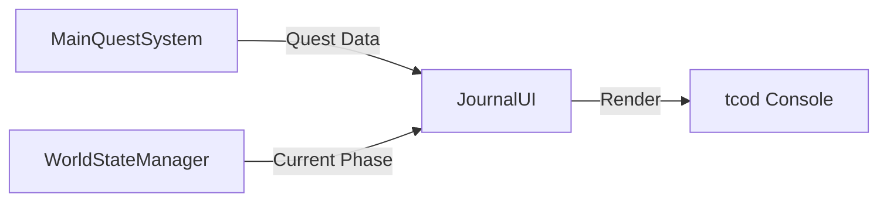

# 冒険日誌（Journal）UI 実装計画書

## 1. 概要
プレイヤーが現在の目標、進行中のクエスト、および過去の達成事項をいつでも確認できる「冒険日誌（Journal）」UIを実装する。これにより、「次に何をすべきか」という目的意識を視覚的にサポートし、UXを向上させる。

## 2. 機能要件

### 2.1 表示内容
- **現在のメインクエスト**:
    - クエスト名、詳細説明。
    - 達成条件（Objectives）のチェックリスト形式表示（例: `[x] 村の長に話しかける`, `[ ] 古の守護者を討伐する`）。
- **ワールドステートの可視化**:
    - 現在のワールドフェーズ（例: 「目覚めの時代」）の表示。
- **完了済みクエスト履歴**:
    - 過去に完了したクエストのリスト。
- **重要メモ/ヒント**:
    - クエスト進行に伴い得た重要な手がかりやヒントの表示。

### 2.2 UI/UX 仕様
- **アクセス方法**: 
    - メインメニュー（コンテキストメニュー）に「冒険日誌」項目を追加。
    - 特定のキー（例: `J` キー）によるクイックオープン。
- **レイアウト**:
    - 画面中央にオーバーレイウィンドウとして表示。
    - 左側に「クエスト一覧」、右側に「詳細内容」を表示する2ペイン構成。
- **操作**:
    - 矢印キーまたはタブキーによる項目選択。
    - `Esc` または `Enter` で閉じる。

## 3. 技術設計

### 3.1 データ連携フロー
`MainQuestSystem` が保持するデータを `JournalUI` が参照して描画する。

### 3.2 実装コンポーネント
- **`JournalUI` クラス (新設)**:
    - `render(console, engine)`: 日誌画面の描画ロジック。
    - `handle_input(key)`: 日誌内でのナビゲーション処理。
- **`Engine` クラスへの統合**:
    - `open_journal()` メソッドを追加し、ゲームループ内で日誌モードへ遷移させる。

## 4. 実装ステップ

### ステップ1: UI基盤の実装
- `ui_fx_systems.py` または新設の `journal_ui.py` に `JournalUI` クラスを作成。
- `tcod` を使用したウィンドウ枠とテキスト描画ロジックの実装。

### ステップ2: データバインディング
- `MainQuestSystem` から `active_quest` および `completed_quests` を取得し、リスト形式で表示する機能を実装。
- `WorldStateManager` から現在のフェーズ名を取得し、ヘッダーに表示。

### ステップ3: インタラクションの実装
- `game.py` の `open_context_menu` に「冒険日誌」を追加。
- `input_handler.py` または `Engine` の入力処理に `J` キーによる起動を追加。

### ステップ4: ブラッシュアップ
- 完了済みクエストにチェックマーク（✓）を付与。
- フェーズに応じた背景色や装飾の変更。

## 5. 期待される効果
- **目的の明確化**: プレイヤーが迷うことなくメインストーリーを追跡できる。
- **達成感の醸成**: 完了済みクエストの蓄積により、自身の成長と物語の進行を実感できる。
- **没入感の向上**: 単なるシステム的な目標提示ではなく、「日誌」という世界観に沿った形式で情報を提示する。
