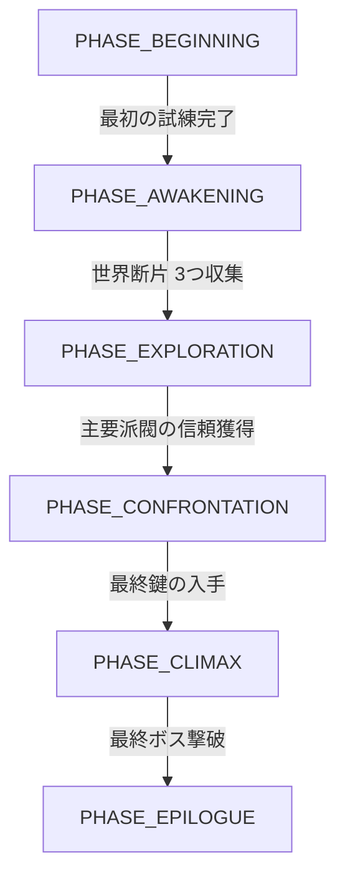

# 「運命運の導き」メインクエスト & ワールドステートシステム 設計書

## 1. 概要
プレイヤーに明確な目的（ゴール）を提供するため、物語の進行度に応じて世界の状態が変化し、それに連動して目標が更新される「メインクエストライン」と、それを支える「拡張ワールドステートシステム」を実装する。

## 2. システムアーキテクチャ

### 2.1 ワールドステートの拡張 (`world_state_system.py`)
既存の `WorldStateManager` を拡張し、単なる変数管理から「物語のフェーズ（Phase）」管理へと昇格させる。

- **WorldPhase (列挙型):**
    - `PHASE_BEGINNING`: 導入期（村での生活、基礎訓練）
    - `PHASE_AWAKENING`: 目覚め（世界の異変に気づき、最初の試練へ）
    - `PHASE_EXPLORATION`: 探索期（各地の断片収集、派閥との接触）
    - `PHASE_CONFRONTATION`: 対立期（真の敵の正体が判明、決戦準備）
    - `PHASE_CLIMAX`: 終局（最終ダンジョンへの挑戦）
    - `PHASE_EPILOGUE`: 後日談（エンディング後の世界）

- **状態遷移ロジック:**
    - 特定のクエスト完了、または特定のワールド変数が閾値に達した際に `current_phase` を更新する。
    - フェーズ移行時に `EventBus` を通じて `WORLD_PHASE_CHANGED` イベントを発行し、他システム（NPC AI、マップ生成、BGM等）に通知する。

### 2.2 メインクエストシステム (`main_quest_system.py` 新設)
`systems.py` の簡易的な `Quest` クラスを卒業し、依存関係を持つクエストツリーを構築する。

- **MainQuest データ構造:**
    - `quest_id`: ユニークID
    - `title`: クエスト名
    - `description`: 目的の説明
    - `requirements`: 解放条件（例: `world_phase == PHASE_AWAKENING`）
    - `objectives`: 達成条件（例: `kill_monster("Ancient Dragon", 1)`, `visit_location("Forbidden Library")`）
    - `rewards`: 報酬（アイテム、スキル、カルマ、ワールドステートの変更）
    - `next_quest_id`: 次に解放されるクエスト

- **クエストトラッカー:**
    - プレイヤーの `Entity` に `MainQuestComponent` を追加し、現在の進行状況を保持する。

## 3. 具体的な実装フロー

### ステップ1: ワールドステートの基盤強化
- `WorldStateManager` に `current_phase` の概念を導入。
- `data/world_state.yaml` にフェーズ定義と初期状態を記述。

### ステップ2: メインクエストエンジンの実装
- `MainQuestSystem` クラスを作成し、クエストのロード、進行判定、報酬付与ロジックを実装。
- `Engine` クラスに統合し、毎ターンまたは特定イベント時に進行状況をチェック。

### ステップ3: 「運命の導き」シナリオの実装
- 導入から終局までのクエストラインを YAML 形式で定義。
- 例: 「村の長から古文書を託される」 $\rightarrow$ 「封印された洞窟を探索する」 $\rightarrow$ 「世界の断片を回収する」。

### ステップ4: ワールドへの反映（ダイナミック・ワールド）
- **NPCのセリフ変化:** `DialogueSystem` と連携し、フェーズに応じたセリフを出し分ける。
- **環境変化:** `MapEngine` と連携し、フェーズが進むと特定のエリアが開放されたり、モンスターの強さが変動したりする。

## 4. 期待される効果
- **プレイヤー体験:** 「次に何をすべきか」が常に明確になり、RPGとしての物語体験が向上する。
- **ゲームサイクル:** 「クエスト受領 $\rightarrow$ 探索・戦闘 $\rightarrow$ 達成 $\rightarrow$ 世界の変化 $\rightarrow$ 新たな目標」という強力なループが形成される。
- **拡張性:** YAMLベースの定義により、エンジンのコードを書き換えずにシナリオの追加や変更が可能になる。

## 5. Mermaidによる状態遷移図

